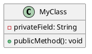

# PlantUML Documentation Setup

This directory contains UML diagrams for the Mario Kart Stats Bot project using PlantUML.

## 🛠️ Setup Instructions

### 1. Prerequisites

- ✅ Java installed (already confirmed: OpenJDK 17.0.2)
- VSCode or Cursor editor

### 2. Install PlantUML Extension

1. Open VSCode/Cursor
2. Go to Extensions (`Ctrl+Shift+X` or `Cmd+Shift+X`)
3. Search for "PlantUML"
4. Install **"PlantUML" by jebbs** (2M+ downloads)

### 3. Optional: Install Graphviz (for better layouts)

```bash
# macOS
brew install graphviz

# Ubuntu/Debian
sudo apt-get install graphviz

# Windows
# Download from: https://graphviz.org/download/
```

## 📋 Available Diagrams

### 1. Class Diagram (`class_diagram.puml`)

- Shows all classes and their relationships
- Includes methods and properties
- Organized by functional packages

### 2. Sequence Diagram (`sequence_diagram.puml`)

- Shows the image processing workflow
- Demonstrates user interactions
- Shows data flow between components

### 3. Component Diagram (`component_diagram.puml`)

- High-level system architecture
- Shows external dependencies
- Illustrates component relationships

## 🎯 How to Use

### View Diagrams

1. Open any `.puml` file
2. Use `Ctrl+Shift+P` (or `Cmd+Shift+P`)
3. Type "PlantUML: Preview Current Diagram"
4. The diagram will open in a new tab

### Export Diagrams

1. Preview the diagram first
2. Right-click on the preview
3. Choose "Save as..." to export as PNG, SVG, or PDF

### Live Preview

- Install "PlantUML Previewer" extension for side-by-side preview
- Automatically updates as you edit

## 🔧 PlantUML Commands Reference

### Common Shortcuts in VSCode/Cursor:

- `Alt+D` - Preview current diagram
- `Ctrl+Shift+P` → "PlantUML: Export Current Diagram"
- `Ctrl+Shift+P` → "PlantUML: Export Workspace Diagrams"

### PlantUML Syntax Basics:



## 📁 File Structure

```
docs/
├── README_PlantUML.md          # This file
├── class_diagram.puml          # Class relationships
├── sequence_diagram.puml       # Image processing flow
└── component_diagram.puml      # System architecture
```

## 🎨 Customization

The diagrams use the "toy" theme for a clean, modern look. You can customize:

- **Colors**: Modify `skinparam` settings
- **Themes**: Change `!theme toy` to `!theme plain`, `!theme blueprint`, etc.
- **Layout**: Add `!pragma layout smetana` for different layouts

## 📖 Additional Resources

- [PlantUML Official Documentation](https://plantuml.com/)
- [PlantUML Class Diagram Guide](https://plantuml.com/class-diagram)
- [PlantUML Sequence Diagram Guide](https://plantuml.com/sequence-diagram)
- [PlantUML Themes](https://plantuml.com/theme)
